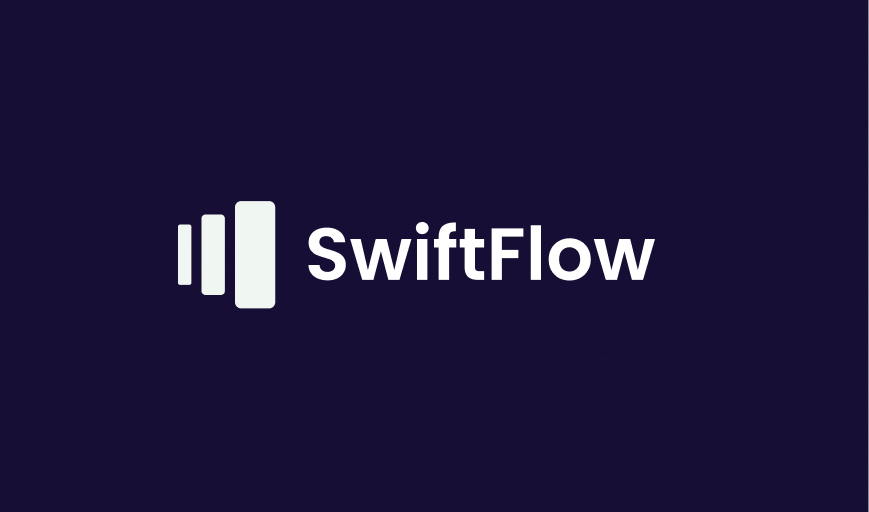

## SwiftFlow

### The SwiftFlow application is a Spring Boot project to manage orders, integrating a comprehensive system for handling providers and clients.

 

 

## Differences:

- This project can track each user's interest and it already matches if the one provider has that one piece.
- Centralized Order Management: Users can manage and track all their orders from a single interface, integrating both order details and order items seamlessly.
- Real-time Inventory Check: The system updates in real-time to reflect the current inventory status of providers, ensuring that users see the most accurate availability information.

 

## About the project:

### Prototype & Diagram:

